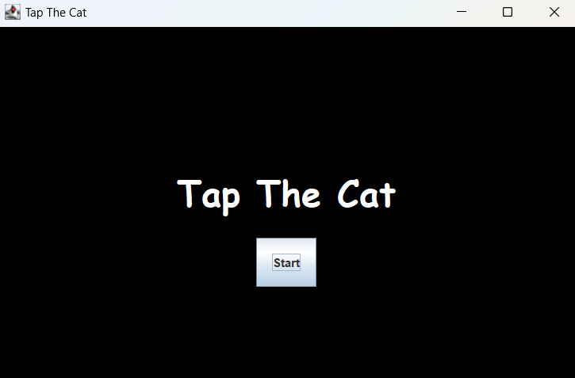
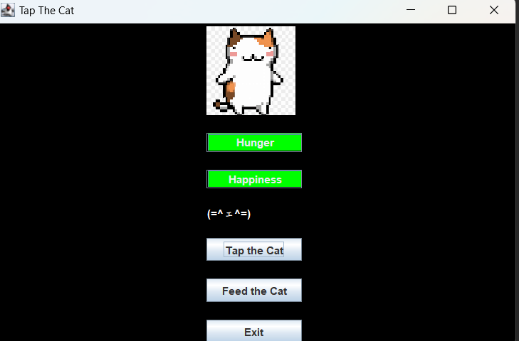

# 🐾 Tap the Cat Meow

**Tap the Cat** is a fun desktop game built with **Java Swing**.  
The goal is simple: tap the cat to make it hungry, then feed it to keep it happy.

👉 *Inspired by the legendary [Bongo Cat](https://bongo.cat/)* 🎶🐱  

## 🎮 Gameplay
- 🖱️ **Tap the Cat** → Increases hunger level.  
- 🍣 **Feed with Favorite Food** → Restores hunger and makes the cat happy.  
- 🥦 **Feed with Vegetables** → Decreases satisfaction, cat becomes disgusted.  
- 😼 Keep the balance — too much tapping without proper food will leave the cat unhappy!  

## 🚀 Features
- Built entirely with **Java Swing** (no external libraries).
- with background music
- Cute interactive cat behavior.  
- Multiple feeding options with different reactions.  
- Lightweight and easy to run on any system with Java installed.  

## 🛠️ Requirements
- **Java 8+** installed on your system.  

## ▶️ How to Run
1. Clone or download this repository.  
2. Compile the source files:  
   ```bash
   javac TapTheCat.java

# 🎮 Gameplay Showcase

Here are some gameplay screenshots from the project:

## 📸 Screenshots

### Screenshot 1


### Screenshot 2


### Screenshot 3

